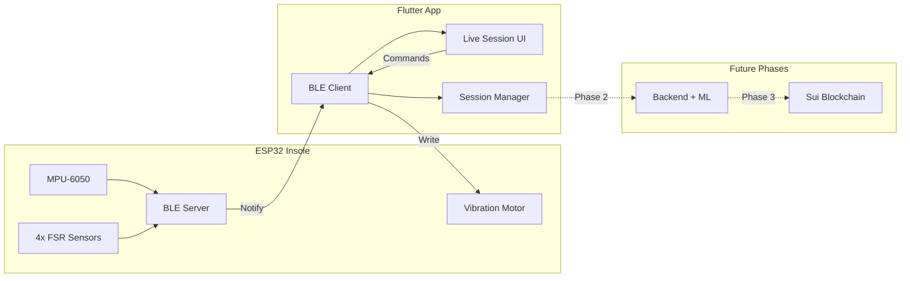

# StepSign BLE Integration and Move-to-Earn Roadmap

## Current State

- **Flutter app**: Complete UI with mock data ([`lib/screens/live_session_screen.dart`](lib/screens/live_session_screen.dart), [`lib/screens/pairing_screen.dart`](lib/screens/pairing_screen.dart))
- **ESP32 firmware**: Basic sensor reading via Serial ([`test/test.ino`](test/test.ino))
- **Hardware**: ESP32 + MPU-6050 + 4 FSRs + vibration motor - all verified working

## Architecture Overview



---

## Phase 1: BLE Integration (Current Focus)

### 1.1 ESP32 Firmware - Add BLE Server

Modify [`test/test.ino`](test/test.ino) to create a proper BLE-enabled firmware:

- **BLE Service UUID**: Custom service for StepSign
- **Characteristics**:
- `SENSOR_DATA` (Notify): Streams packed sensor data at 50Hz
- `DEVICE_INFO` (Read): Battery level, firmware version
- `HAPTIC_CMD` (Write): Control vibration motor from app
- **Data format**: Packed binary struct (20 bytes per frame)
```javascript
struct SensorFrame {
    int16_t ax, ay, az;      // Accelerometer (6 bytes)
    int16_t gx, gy, gz;      // Gyroscope (6 bytes)
    uint16_t fsr[4];         // FSR values (8 bytes)
    // Total: 20 bytes per notification
}
```


### 1.2 Flutter App - BLE Integration

Add `flutter_blue_plus` package and update:

- [`lib/screens/pairing_screen.dart`](lib/screens/pairing_screen.dart): Replace simulated scanning with real BLE discovery
- [`lib/screens/live_session_screen.dart`](lib/screens/live_session_screen.dart): Subscribe to real sensor notifications
- Create new `lib/services/ble_service.dart`: Centralized BLE connection manager

### 1.3 Data Flow Wiring

Connect real sensor data to existing UI widgets:

- [`lib/widgets/heatmap_full.dart`](lib/widgets/heatmap_full.dart): FSR data → pressure visualization
- [`lib/widgets/imu_orientation_mini.dart`](lib/widgets/imu_orientation_mini.dart): IMU data → orientation display
- Waveform painter in live session: Real-time accelerometer stream

---

## Phase 2: Local Step Detection + Session Recording (Future)

- Implement step detection algorithm on ESP32 (peak detection on vertical acceleration)
- Add session recording in Flutter (save sensor windows locally)
- Prepare session summary format for backend submission

---

## Phase 3: Backend + ML Anti-Cheat (Future)

- Python FastAPI backend to receive session summaries
- Train ML model on labeled data (real walks vs. cheats)
- Issue signed attestations for valid sessions

---

## Phase 4: Sui Smart Contracts (Future)

- Move module for STEP token (Sui Coin pattern)
- Claim reward function verifying backend attestation signature
- Wallet integration in Flutter using Sui SDK

---

## Files to Create/Modify (Phase 1)

| File | Action | Purpose |

|------|--------|---------|

| `firmware/stepsign_ble/stepsign_ble.ino` | Create | Full BLE-enabled firmware |

| `lib/services/ble_service.dart` | Create | BLE connection manager singleton |

| `lib/models/sensor_data.dart` | Create | Data models for sensor frames |

| `lib/screens/pairing_screen.dart` | Modify | Real BLE scanning |

| `lib/screens/live_session_screen.dart` | Modify | Real sensor stream |

| `pubspec.yaml` | Modify | Add flutter_blue_plus dependency |---

## Deliverables for Phase 1

1. ESP32 firmware broadcasting sensor data over BLE at 50Hz
2. Flutter app discovering and connecting to real StepSign devices
3. Live session showing real pressure heatmap and IMU orientation