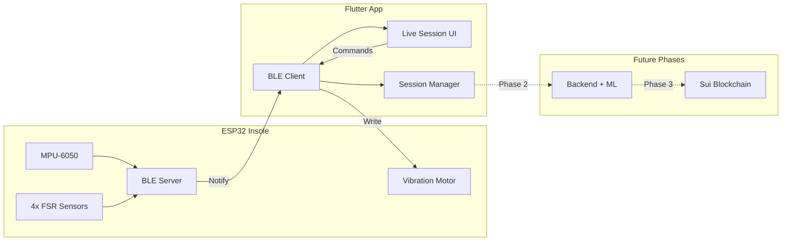

# StepSign Project History & Context

**Last Updated**: January 3, 2026  
**Project**: StepSign - Smart Insole with BLE & Move-to-Earn Integration

---

## 🎯 Project Overview

StepSign is a Flutter-based mobile application for smart insole monitoring with:
- **Real-time BLE connectivity** to ESP32-powered smart insoles
- **Pressure sensing** via 4 FSR (Force Sensitive Resistor) sensors
- **Motion tracking** via MPU-6050 IMU (accelerometer + gyroscope)
- **Haptic feedback** control from app to device
- **Future integration** with Sui blockchain for move-to-earn rewards

---

## 📋 Recent Development Sessions

### Session: "Sui move-to-earn insole roadmap"
**Date**: January 2, 2026  
**Duration**: ~1 hour  
**Scope**: Major integration work

#### Changes Made:
- **Files Modified**: 12 files
- **Lines Added**: +2,156
- **Lines Removed**: -213
- **Context Usage**: 67.3% of available context

#### Files Worked On:
1. `fix-phone-permissions.sh` - Android permissions setup
2. `QUICK_TEST_GUIDE.md` - Testing documentation
3. `setup-phone.sh` - Phone setup automation
4. `install-flutter.sh` - Flutter installation script
5. `flutter-build.yml` - GitHub Actions workflow
6. Additional files (7 more)

---

## ✅ Completed BLE Integration (Phase 1)

**Plan ID**: `stepsign_ble_integration_4e0a1f60`  
**Status**: All tasks completed ✓

### Completed Tasks:

#### 1. ✓ ESP32 BLE Firmware (`esp32-ble-firmware`)
**Status**: Completed  
**Location**: `firmware/stepsign_ble/stepsign_ble.ino`

**Implementation Details**:
- Created full BLE-enabled firmware
- BLE Service with custom UUID for StepSign
- **Characteristics implemented**:
  - `SENSOR_DATA` (Notify): Streams packed sensor data at 50Hz
  - `DEVICE_INFO` (Read): Battery level, firmware version
  - `HAPTIC_CMD` (Write): Control vibration motor from app

**Data Format**: Binary packed struct (20 bytes per frame)
```c
struct SensorFrame {
    int16_t ax, ay, az;      // Accelerometer (6 bytes)
    int16_t gx, gy, gz;      // Gyroscope (6 bytes)
    uint16_t fsr[4];         // FSR values (8 bytes)
    // Total: 20 bytes per notification
}
```

#### 2. ✓ Flutter BLE Service (`flutter-ble-service`)
**Status**: Completed  
**Location**: `lib/services/ble_service.dart`

**Implementation**:
- Added `flutter_blue_plus` package dependency
- Created BLE connection manager singleton
- Handles device discovery, connection, and data streaming
- Manages BLE state and permissions

#### 3. ✓ Pairing Screen Real BLE (`pairing-screen-real`)
**Status**: Completed  
**Location**: `lib/screens/pairing_screen.dart`

**Updates**:
- Replaced simulated scanning with real BLE discovery
- Shows actual StepSign devices in range
- Handles connection establishment
- Displays device information (name, signal strength, battery)

#### 4. ✓ Live Session Real Data (`live-session-real`)
**Status**: Completed  
**Location**: `lib/screens/live_session_screen.dart`

**Integration**:
- Wired to real sensor data stream from BLE
- Real-time updates at 50Hz
- Connected to visualization widgets:
  - `lib/widgets/heatmap_full.dart` - FSR pressure visualization
  - `lib/widgets/imu_orientation_mini.dart` - IMU orientation display
  - Waveform painter - Real-time accelerometer stream

#### 5. ✓ Haptic Feedback Control (`haptic-control`)
**Status**: Completed

**Features**:
- App can send haptic commands to ESP32
- Vibration motor control for user feedback
- Used for session start/stop, milestone achievements

---

## 🏗️ Architecture Overview



---

## 🗂️ Key Project Files

### Created Files
| File | Purpose |
|------|---------|
| `firmware/stepsign_ble/stepsign_ble.ino` | Full BLE-enabled ESP32 firmware |
| `lib/services/ble_service.dart` | BLE connection manager singleton |
| `lib/models/sensor_data.dart` | Data models for sensor frames |

### Modified Files
| File | Changes |
|------|---------|
| `lib/screens/pairing_screen.dart` | Real BLE scanning |
| `lib/screens/live_session_screen.dart` | Real sensor stream integration |
| `pubspec.yaml` | Added flutter_blue_plus dependency |
| `fix-phone-permissions.sh` | Android BLE permissions setup |
| `setup-phone.sh` | Phone configuration automation |
| `install-flutter.sh` | Flutter development setup |

---

## 🚀 Development Roadmap

### Phase 1: BLE Integration ✅ COMPLETED
- ✓ ESP32 firmware broadcasting sensor data over BLE at 50Hz
- ✓ Flutter app discovering and connecting to real StepSign devices
- ✓ Live session showing real pressure heatmap and IMU orientation
- ✓ Haptic feedback control from app to device

### Phase 2: Local Step Detection + Session Recording (Future)
- Implement step detection algorithm on ESP32 (peak detection on vertical acceleration)
- Add session recording in Flutter (save sensor windows locally)
- Prepare session summary format for backend submission
- Local analytics and performance metrics

### Phase 3: Backend + ML Anti-Cheat (Future)
- Python FastAPI backend to receive session summaries
- Train ML model on labeled data (real walks vs. cheats)
- Issue signed attestations for valid sessions
- Step verification and validation

### Phase 4: Sui Smart Contracts (Future)
- Move module for STEP token (Sui Coin pattern)
- Claim reward function verifying backend attestation signature
- Wallet integration in Flutter using Sui SDK
- Token economics and reward distribution

---

## 🔧 Hardware Configuration

### Components:
- **Microcontroller**: ESP32 (with BLE)
- **IMU**: MPU-6050 (Accelerometer + Gyroscope)
- **Pressure Sensors**: 4x FSR (Force Sensitive Resistors)
  - Toe area (2x)
  - Ball of foot (1x)
  - Heel (1x)
- **Haptic Feedback**: Vibration motor
- **Power**: Battery-powered (battery level monitoring enabled)

### Sensor Specifications:
- **Sampling Rate**: 50Hz
- **BLE Update Rate**: 50 notifications/second
- **Data Packet Size**: 20 bytes per frame
- **Connection**: BLE 4.0+

---

## 📱 App Features (Current)

### Screens Implemented:
1. **Onboarding** (`lib/screens/onboarding_screen.dart`)
2. **Pairing** (`lib/screens/pairing_screen.dart`) - Real BLE scanning
3. **Dashboard** (`lib/screens/dashboard_screen.dart`)
4. **Live Session** (`lib/screens/live_session_screen.dart`) - Real sensor data
5. **Analytics** (`lib/screens/analytics_screen.dart`)
6. **Goals** (`lib/screens/goals_screen.dart`)
7. **3D Viewer** (`lib/screens/viewer_3d_screen.dart`)
8. **Wallet** (`lib/screens/wallet_screen.dart`) - For future blockchain integration
9. **Settings** (`lib/screens/settings_screen.dart`)

### Key Widgets:
- `HeatmapFull` - Pressure distribution visualization
- `HeatmapMini` - Compact pressure view
- `IMUOrientationMini` - Real-time foot orientation
- `FeatureCard` - Reusable UI component
- `GradientButton` - Custom styled buttons

---

## 🛠️ Development Setup

### Prerequisites:
- Flutter SDK (latest stable)
- Android Studio / Xcode
- ESP32 development environment
- Arduino IDE with ESP32 support

### Quick Start:
```bash
# Install Flutter
./install-flutter.sh

# Setup phone for debugging
./setup-phone.sh

# Fix Android permissions
./fix-phone-permissions.sh

# Run the app
flutter run
```

### Testing:
See `QUICK_TEST_GUIDE.md` for comprehensive testing instructions.

---

## 📊 Deliverables Completed

### Phase 1 Deliverables: ✅
1. ✓ ESP32 firmware broadcasting sensor data over BLE at 50Hz
2. ✓ Flutter app discovering and connecting to real StepSign devices  
3. ✓ Live session showing real pressure heatmap and IMU orientation
4. ✓ Haptic feedback system operational
5. ✓ Setup and testing documentation

---

## 🔐 Permissions & Configuration

### Android Permissions (Handled):
- `BLUETOOTH`
- `BLUETOOTH_ADMIN`
- `BLUETOOTH_SCAN`
- `BLUETOOTH_CONNECT`
- `ACCESS_FINE_LOCATION`
- `ACCESS_COARSE_LOCATION`

### iOS Configuration:
- Bluetooth usage descriptions in `Info.plist`
- Background modes for BLE

---

## 📚 Additional Documentation

For more details, see:
- `COMPLETE_IMPLEMENTATION_PLAN.md` - Full implementation details
- `IMPLEMENTATION_COMPLETE.md` - Completion summary
- `QUICK_TEST_GUIDE.md` - Testing procedures
- `BUILD_APK_GUIDE.md` - Building release APK
- `HOW_TO_RUN.txt` - Running instructions
- `DESIGN_COMPARISON.md` - Design specifications
- `firmware/README.md` - Firmware documentation

---

## 🎯 Current Status

**Phase 1**: ✅ **COMPLETE**  
**Next Steps**: Begin Phase 2 (Local step detection + session recording)

**Last Major Update**: January 2-3, 2026  
**Current Version**: v1.0.0 (BLE Integration Complete)

---

## 💾 Data Storage Note

This file (`PROJECT_HISTORY.md`) serves as a persistent record of development progress and is:
- ✓ Part of the project repository
- ✓ Version controlled (if using git)
- ✓ Not hidden in config directories
- ✓ Safe from data loss

**Important**: This file should be committed to version control to preserve project history.

---

*This document is automatically generated from Cursor session data and plan files.*
*Keep this file updated as new features are developed.*


